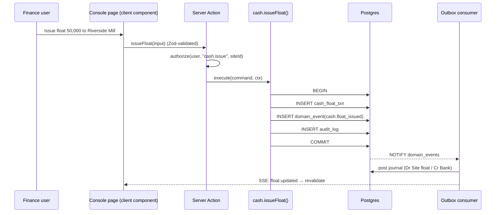
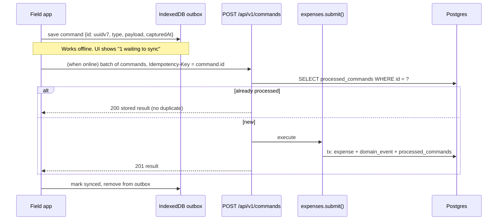
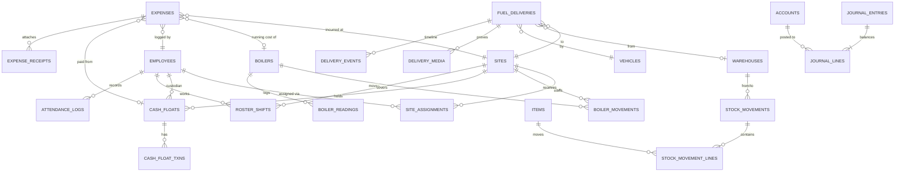
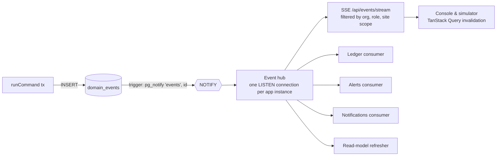

# Stoker — Architecture

**Companion to:** `PRD.md`, `DESIGN.md`
**Status:** Draft v1.0
**Stack:** Next.js 15 (App Router) · React 19 · TypeScript (strict) · Tailwind CSS v4 · PostgreSQL 16

---

## 1. Architectural principles

1. **One Postgres, one source of truth.** Business data, the job queue, the event log and the realtime fan-out all live in Postgres. No Redis or Kafka until load proves we need them.
2. **Derived, never edited.** Stock levels, float balances and ledger balances are computed from immutable movements and journal lines. Corrections are new records (reversals, adjustments), never updates to history.
3. **Every write is a command.** UI and field app both send commands (`expense.submit`, `delivery.recordArrival`) to the same domain services. The web console and the future native app share one API contract.
4. **Events out of every command.** Each successful command writes a `domain_event` in the same transaction (transactional outbox). Ledger posting, notifications, realtime updates and the simulator's data-flow panel all consume these events.
5. **Offline is normal for the field.** Field commands carry a client-generated idempotency key and the original capture time, so replays are safe and history is truthful.
6. **Modular monolith.** One deployable Next.js app with strict internal module boundaries. Modules talk through service interfaces and events, never by reaching into each other's tables.
7. **Type safety end to end.** Zod schemas in a shared package define every command and response; database types come from Drizzle; the client infers from both.

## 2. System context

```mermaid
flowchart LR
  subgraph Users
    HO[Head office staff<br/>Admin · Ops · Finance · HR · Warehouse]
    FW[Field users<br/>Supervisors · Operators · Drivers]
  end

  subgraph Stoker["Stoker (Next.js app)"]
    CON[Console UI<br/>/app/(console)]
    FLD[Field UI<br/>/app/(field)]
    SIM[Simulator<br/>/app/simulator]
    API[Command & query layer<br/>Server Actions + /api/v1]
    DOM[Domain modules]
    WRK[Worker process<br/>pg-boss jobs]
  end

  PG[(PostgreSQL 16)]
  S3[(Object storage<br/>S3 / R2 / MinIO)]
  MAIL[Email provider]
  MAPS[Map tiles]

  HO --> CON
  FW --> FLD
  HO --> SIM
  SIM -- embeds --> FLD
  CON --> API
  FLD --> API
  API --> DOM --> PG
  FLD -- presigned upload --> S3
  WRK --> PG
  WRK --> S3
  WRK --> MAIL
  CON --> MAPS
  PG -- LISTEN/NOTIFY --> API
  API -- SSE --> CON
  API -- SSE --> SIM
```

## 3. Technology choices

| Concern | Choice | Why |
|---|---|---|
| Framework | **Next.js 15, App Router** | Server Components for data-heavy console pages, Server Actions for mutations, route handlers for the public API, one deployable |
| Language | **TypeScript, `strict: true`, `noUncheckedIndexedAccess`** | Money and quantities demand it |
| Styling | **Tailwind CSS v4** with CSS-variable tokens from `DESIGN.md` | Tokens in one place, themeable (Day / Night shift) |
| UI primitives | **Radix UI** primitives wrapped in our own `@stoker/ui` components | Accessible behaviour, our own look |
| Tables | **TanStack Table** + server-side pagination/filter/sort | Ledgers and expense lists get large |
| Forms | **React Hook Form + Zod** resolvers using shared schemas | Same validation on client and server |
| Client data | **TanStack Query** for client components and the field app; RSC fetch for console pages | Field app needs caching, retries and offline replay |
| Database | **PostgreSQL 16** | Check constraints, deferrable constraints, partial indexes, `LISTEN/NOTIFY`, JSONB, PostGIS optional |
| ORM / SQL | **Drizzle ORM + drizzle-kit migrations** | SQL-first, typed, lets us write constraints, triggers and views directly |
| Auth | **Better Auth** (email + password, magic link, TOTP 2FA) with database sessions | Self-hosted, Postgres-backed, works with RSC |
| Jobs | **pg-boss** | Postgres-backed queue: retries, scheduling, no extra infra |
| Realtime | **Postgres `LISTEN/NOTIFY` → Server-Sent Events** | One-way server push is all we need; works behind most proxies |
| Files | **S3-compatible storage** (MinIO locally, Cloudflare R2 or AWS S3 in production), presigned PUT/GET | Large photos and videos never pass through the app server |
| Media processing | **sharp** (images), **ffmpeg** (video poster frames, transcode to H.264 720p) in the worker | Thumbnails and consistent playback |
| Maps | **MapLibre GL** with an OSM-based tile provider | No per-load fees; geofence drawing |
| Charts | **Recharts** themed with design tokens; custom SVG for the gauge component | |
| Offline (field) | **IndexedDB via Dexie**, service worker via **Serwist** | Durable outbox and media queue |
| i18n | **next-intl** with RTL support | |
| Monorepo | **pnpm workspaces + Turborepo** | Shared packages for schemas, UI, domain |
| Testing | **Vitest** (unit), **Testcontainers Postgres** (integration), **Playwright** (e2e, includes simulator scenarios) | |
| Observability | **OpenTelemetry** traces, **Pino** structured logs, **Sentry** for errors | |

## 4. Repository layout

```
stoker/
├─ apps/
│  ├─ web/                         # The Next.js app (console + field + simulator + API)
│  │  ├─ app/
│  │  │  ├─ (auth)/login/…
│  │  │  ├─ (console)/             # Head-office UI, sidebar shell
│  │  │  │  ├─ dashboard/
│  │  │  │  ├─ sites/[siteId]/{overview,boilers,workforce,shifts,expenses,cash,fuel,ledger,activity}/
│  │  │  │  ├─ boilers/[boilerId]/
│  │  │  │  ├─ expenses/
│  │  │  │  ├─ cash/
│  │  │  │  ├─ deliveries/[deliveryId]/
│  │  │  │  ├─ inventory/{items,stock,movements,warehouses}/
│  │  │  │  ├─ ledgers/{general,sites,employees,vendors,accounts}/
│  │  │  │  ├─ hr/{employees,roster,attendance,leave,payroll}/
│  │  │  │  ├─ reports/
│  │  │  │  └─ settings/
│  │  │  ├─ (field)/f/             # Stoker Field, mobile-first, installable PWA
│  │  │  │  ├─ home/  expenses/  deliveries/[id]/arrival/  boiler/[id]/reading/
│  │  │  │  ├─ attendance/  cash/  leave/  sync/
│  │  │  ├─ simulator/             # Phone frames + data-flow panel + live console pane
│  │  │  └─ api/
│  │  │     ├─ v1/[...route]/      # REST for the field app (and future native app)
│  │  │     ├─ events/stream/      # SSE endpoint
│  │  │     └─ uploads/presign/
│  │  ├─ worker/                   # pg-boss worker entry (same codebase, separate process)
│  │  └─ middleware.ts             # session check, role-based route guard, locale
├─ packages/
│  ├─ db/                          # Drizzle schema, migrations, SQL views, seed + sandbox seed
│  ├─ domain/                      # Pure domain modules (no Next.js imports)
│  │  ├─ sites/ boilers/ workforce/ expenses/ cash/ fuel/ inventory/ ledger/ hr/ alerts/ audit/
│  │  └─ shared/ (money, quantity, clock, ids, errors, events)
│  ├─ contracts/                   # Zod schemas for commands, queries, events; API types
│  ├─ ui/                          # Design-system components (tokens from DESIGN.md)
│  ├─ field-sync/                  # Outbox, media queue, replay logic (IndexedDB)
│  ├─ simulator/                   # Scenario engine, virtual devices, event tracer
│  └─ config/                      # eslint, tsconfig, tailwind preset
└─ infra/
   ├─ docker-compose.yml           # postgres, minio, mailpit
   └─ deploy/                      # Dockerfiles, CI workflows
```

**Boundary rule** (enforced with `eslint-plugin-boundaries`): `apps/web` may import `domain`, `contracts`, `ui`, `db` (for wiring only). A domain module may import `domain/shared` and its own tables, and may call another module only through that module's exported service. `ui` imports nothing from `domain` or `db`.

## 5. Request flow

### 5.1 Console mutation (Server Action)



### 5.2 Field command (REST, offline-capable)



All field writes go through a single `POST /api/v1/commands` batch endpoint. This makes replay, ordering and idempotency one mechanism instead of many. Reads use resource endpoints (`GET /api/v1/me/sites`, `GET /api/v1/deliveries?status=dispatched`).

## 6. Domain modules

| Module | Owns tables | Key commands | Emits |
|---|---|---|---|
| `sites` | sites, site_contacts, site_geofences | createSite, updateSite, changeStatus | site.created, site.status_changed |
| `boilers` | boilers, boiler_movements, boiler_readings, maintenance_events | registerBoiler, reserve, dispatch, confirmInstall, recordReading, logMaintenance, startReturn | boiler.moved, boiler.reading_recorded |
| `workforce` | site_assignments | assignEmployee, endAssignment | workforce.assigned, workforce.unassigned |
| `expenses` | expenses, expense_receipts, expense_approvals, expense_categories | submit, approve, reject, requestInfo, resubmit | expense.submitted, expense.approved, expense.rejected |
| `cash` | cash_floats, cash_float_txns, settlements | requestFloat, issueFloat, topUp, transfer, returnCash, settle | cash.float_issued, cash.transferred, cash.settled |
| `fuel` | vehicles, fuel_deliveries, delivery_events, delivery_media | plan, recordLoading, dispatch, recordArrival, verify, dispute, resolve | fuel.dispatched, fuel.arrived, fuel.disputed, fuel.verified |
| `inventory` | warehouses, items, stock_movements, stock_movement_lines, item_serials | receive, issue, transfer, return, adjust | inventory.moved |
| `ledger` | accounts, journal_entries, journal_lines, periods | post (internal), reverse, manualEntry, closePeriod | ledger.posted |
| `hr` | employees, employee_documents, shift_templates, roster_shifts, attendance_logs, leave_requests, payroll_runs | createEmployee, publishRoster, checkIn, checkOut, requestLeave, approveLeave, runPayrollInputs | hr.checked_in, hr.leave_approved |
| `alerts` | alert_rules, alerts | evaluate (job), acknowledge | alert.raised |
| `audit` | audit_log | (written by command middleware) | — |

Each command handler has the shape:

```ts
// packages/domain/shared/command.ts
export type CommandContext = {
  actor: { userId: string; roles: Role[]; siteIds: string[] };
  orgId: string;
  now: Date;                 // server time
  capturedAt?: Date;         // device time for field commands
  idempotencyKey?: string;
  source: "console" | "field" | "simulator" | "system";
  tx: DbTransaction;
};

export interface CommandHandler<I, O> {
  name: string;               // "expenses.submit"
  input: z.ZodType<I>;
  authorize(ctx: CommandContext, input: I): Promise<void>;   // throws Forbidden
  execute(ctx: CommandContext, input: I): Promise<{ result: O; events: DomainEvent[] }>;
}
```

A single `runCommand()` wrapper opens the transaction, checks idempotency, calls `authorize` then `execute`, writes events to the outbox and the audit log, and commits. Server Actions and the REST endpoint both call `runCommand()`.

## 7. Data model

### 7.1 Conventions

- Primary keys: `uuid` generated as **UUIDv7** (time-ordered, client-generatable for offline creates).
- Every business table: `org_id`, `created_at`, `created_by`, `updated_at`, `updated_by`, `deleted_at` (soft delete where allowed).
- **Money:** `bigint` minor units (`amount_minor`) plus `currency char(3)`. Never floats. A `Money` value object in `domain/shared` does arithmetic and formatting.
- **Quantities:** `numeric(14,3)` with an explicit `uom` (`kg`, `t`, `pcs`, `l`). Fuel stored in kg.
- **Time:** `timestamptz` everywhere; field records keep both `captured_at` (device) and `received_at` (server).
- **Status columns:** Postgres enums or `text` + `CHECK`, with transitions enforced in the domain layer and history kept in an `*_events` table.

### 7.2 Entity relationships (core)



### 7.3 Key tables (abridged DDL)

```sql
-- Locations are polymorphic for stock and boilers: a warehouse, a site, or a vehicle.
CREATE TYPE location_kind AS ENUM ('warehouse','site','vehicle');

CREATE TABLE sites (
  id uuid PRIMARY KEY, org_id uuid NOT NULL,
  code text NOT NULL, name text NOT NULL, client_name text,
  address text, lat double precision, lng double precision,
  geofence_radius_m int NOT NULL DEFAULT 300,
  status text NOT NULL CHECK (status IN ('draft','active','on_hold','closing','closed')),
  contract_start date, contract_end date,
  created_at timestamptz NOT NULL DEFAULT now(), created_by uuid, updated_at timestamptz, updated_by uuid,
  UNIQUE (org_id, code)
);

CREATE TABLE boilers (
  id uuid PRIMARY KEY, org_id uuid NOT NULL,
  serial_no text NOT NULL, make text, model text,
  capacity_value numeric(10,2), capacity_uom text,           -- e.g. 2000 'kg/h'
  pressure_rating_bar numeric(6,2), fuel_types text[] NOT NULL,
  state text NOT NULL CHECK (state IN ('in_warehouse','reserved','in_transit','installed','maintenance','returning','retired')),
  location_kind location_kind NOT NULL, location_id uuid NOT NULL,   -- denormalised current location
  running_hours numeric(12,1) NOT NULL DEFAULT 0,
  purchase_cost_minor bigint, currency char(3),
  UNIQUE (org_id, serial_no)
);

CREATE TABLE boiler_movements (
  id uuid PRIMARY KEY, boiler_id uuid NOT NULL REFERENCES boilers,
  from_kind location_kind, from_id uuid, to_kind location_kind NOT NULL, to_id uuid NOT NULL,
  state_after text NOT NULL, moved_at timestamptz NOT NULL, actor_id uuid NOT NULL, note text
);

CREATE TABLE site_assignments (
  id uuid PRIMARY KEY, site_id uuid NOT NULL REFERENCES sites, employee_id uuid NOT NULL,
  site_role text NOT NULL CHECK (site_role IN ('supervisor','operator','helper','guard','driver')),
  starts_on date NOT NULL, ends_on date,
  EXCLUDE USING gist (employee_id WITH =, daterange(starts_on, ends_on, '[]') WITH &&)  -- one site at a time
);

CREATE TABLE cash_floats (
  id uuid PRIMARY KEY, org_id uuid NOT NULL,
  site_id uuid REFERENCES sites, custodian_id uuid NOT NULL,   -- employee holding the cash
  account_id uuid NOT NULL,                                   -- ledger sub-account for this float
  currency char(3) NOT NULL, min_balance_minor bigint DEFAULT 0,
  status text NOT NULL CHECK (status IN ('active','settling','closed'))
);

CREATE TABLE cash_float_txns (
  id uuid PRIMARY KEY, float_id uuid NOT NULL REFERENCES cash_floats,
  kind text NOT NULL CHECK (kind IN ('issue','top_up','expense','transfer_in','transfer_out','return','variance')),
  amount_minor bigint NOT NULL,              -- signed: + increases float, − decreases
  source_type text, source_id uuid,          -- e.g. ('expense', <id>)
  occurred_at timestamptz NOT NULL, captured_at timestamptz, actor_id uuid NOT NULL
);

CREATE TABLE expenses (
  id uuid PRIMARY KEY, org_id uuid NOT NULL,
  kind text NOT NULL CHECK (kind IN ('running','personal','site')),
  site_id uuid NOT NULL REFERENCES sites, boiler_id uuid REFERENCES boilers,
  employee_id uuid NOT NULL, category_id uuid NOT NULL, vendor_id uuid,
  amount_minor bigint NOT NULL CHECK (amount_minor > 0), currency char(3) NOT NULL,
  payment_source text NOT NULL CHECK (payment_source IN ('float','own_pocket','company_card','vendor_credit')),
  float_id uuid REFERENCES cash_floats,
  spent_on date NOT NULL, description text,
  status text NOT NULL CHECK (status IN ('submitted','needs_info','approved','rejected','posted','reimbursed')),
  captured_at timestamptz NOT NULL, received_at timestamptz NOT NULL DEFAULT now(),
  duplicate_of uuid,
  CHECK (kind <> 'running' OR boiler_id IS NOT NULL),
  CHECK (payment_source <> 'float' OR float_id IS NOT NULL)
);

CREATE TABLE fuel_deliveries (
  id uuid PRIMARY KEY, org_id uuid NOT NULL, code text NOT NULL,
  source_kind text NOT NULL CHECK (source_kind IN ('warehouse','supplier')),
  warehouse_id uuid, supplier_id uuid,
  site_id uuid NOT NULL REFERENCES sites, vehicle_id uuid NOT NULL, driver_id uuid,
  fuel_item_id uuid NOT NULL,                       -- e.g. rice husk, wood chips
  planned_qty_kg numeric(14,3) NOT NULL, dispatched_qty_kg numeric(14,3), received_qty_kg numeric(14,3),
  tolerance_pct numeric(5,2) NOT NULL DEFAULT 2.0,
  status text NOT NULL CHECK (status IN ('planned','loading','dispatched','arrived','verified','disputed','closed','cancelled')),
  planned_for date, dispatched_at timestamptz, arrived_at timestamptz,
  variance_kg numeric(14,3) GENERATED ALWAYS AS (received_qty_kg - dispatched_qty_kg) STORED
);

CREATE TABLE delivery_media (
  id uuid PRIMARY KEY, delivery_id uuid NOT NULL REFERENCES fuel_deliveries,
  purpose text NOT NULL CHECK (purpose IN ('vehicle_plate','load','unloading_video','weighbridge_slip','loading')),
  media_type text NOT NULL CHECK (media_type IN ('image','video')),
  object_key text NOT NULL, poster_key text, sha256 char(64) NOT NULL,
  bytes bigint, duration_s numeric(6,1),
  captured_at timestamptz NOT NULL, device_time_skew_s int,
  lat double precision, lng double precision, accuracy_m real,
  distance_from_site_m real, inside_geofence boolean,
  captured_by uuid NOT NULL, processing_state text NOT NULL DEFAULT 'pending'
);

-- Ledger
CREATE TABLE accounts (
  id uuid PRIMARY KEY, org_id uuid NOT NULL, code text NOT NULL, name text NOT NULL,
  type text NOT NULL CHECK (type IN ('asset','liability','equity','revenue','expense')),
  parent_id uuid REFERENCES accounts,
  dimension_type text, dimension_id uuid,          -- e.g. ('site', <id>) or ('employee', <id>) sub-ledgers
  UNIQUE (org_id, code)
);

CREATE TABLE journal_entries (
  id uuid PRIMARY KEY, org_id uuid NOT NULL, entry_no bigserial,
  posted_at timestamptz NOT NULL, effective_date date NOT NULL,
  source_type text NOT NULL, source_id uuid NOT NULL,       -- link back to the business document
  narration text, reverses_id uuid REFERENCES journal_entries,
  UNIQUE (source_type, source_id, reverses_id)              -- one posting per source (plus its reversal)
);

CREATE TABLE journal_lines (
  id uuid PRIMARY KEY, entry_id uuid NOT NULL REFERENCES journal_entries,
  account_id uuid NOT NULL REFERENCES accounts,
  debit_minor bigint NOT NULL DEFAULT 0 CHECK (debit_minor >= 0),
  credit_minor bigint NOT NULL DEFAULT 0 CHECK (credit_minor >= 0),
  site_id uuid, employee_id uuid, boiler_id uuid, vendor_id uuid, warehouse_id uuid,   -- reporting dimensions
  CHECK ((debit_minor = 0) <> (credit_minor = 0))
);

-- Balanced-entry guarantee, checked at commit
CREATE CONSTRAINT TRIGGER journal_balanced
  AFTER INSERT OR UPDATE ON journal_lines DEFERRABLE INITIALLY DEFERRED
  FOR EACH ROW EXECUTE FUNCTION assert_entry_balanced();

-- Event outbox and idempotency
CREATE TABLE domain_events (
  id bigserial PRIMARY KEY, org_id uuid NOT NULL, type text NOT NULL,
  aggregate_type text NOT NULL, aggregate_id uuid NOT NULL,
  payload jsonb NOT NULL, actor_id uuid, source text NOT NULL,
  trace_id text, occurred_at timestamptz NOT NULL DEFAULT now(),
  is_sandbox boolean NOT NULL DEFAULT false
);
CREATE TABLE processed_commands (
  id uuid PRIMARY KEY, name text NOT NULL, actor_id uuid NOT NULL,
  result jsonb NOT NULL, processed_at timestamptz NOT NULL DEFAULT now()
);
CREATE TABLE event_consumers (consumer text PRIMARY KEY, last_event_id bigint NOT NULL DEFAULT 0);

CREATE TABLE audit_log (
  id bigserial PRIMARY KEY, org_id uuid NOT NULL, actor_id uuid, action text NOT NULL,
  entity_type text NOT NULL, entity_id uuid NOT NULL,
  before jsonb, after jsonb, ip inet, user_agent text, at timestamptz NOT NULL DEFAULT now()
);
```

Other tables follow the same pattern: `employees`, `employee_documents`, `shift_templates`, `roster_shifts`, `attendance_logs` (with selfie object key, GPS, inside-geofence flag), `leave_types`, `leave_requests`, `payroll_runs`, `payroll_lines`, `vehicles`, `suppliers`, `vendors`, `warehouses`, `items`, `item_serials`, `stock_movements`, `stock_movement_lines`, `expense_categories`, `expense_approvals`, `alert_rules`, `alerts`, `notifications`, `users`, `user_roles`, `user_site_scopes`.

### 7.4 Derived read models (SQL views / materialised views)

| View | Purpose | Refresh |
|---|---|---|
| `v_float_balances` | Issued, spent, pending, returned, available per float | Plain view (indexed on `float_id`) |
| `v_stock_on_hand` | Quantity per item per location from movement lines | Materialised, refreshed by `inventory.moved` consumer |
| `v_site_fuel_position` | Delivered − consumed per site, days remaining | Materialised, refreshed on delivery/reading events |
| `v_account_balances` | Running balance per account per period | Materialised nightly + on period close |
| `v_site_month_summary` | Expenses by category, fuel, payroll allocation per site per month | Materialised, refreshed hourly and on demand |

Balances are always recomputable from the underlying rows, so a materialised view can be dropped and rebuilt without data loss.

## 8. Ledger design

Every financial command emits an event; the **ledger consumer** maps it to a balanced journal entry using a posting-rule table. Rules are code (versioned, tested), not user-editable.

| Event | Debit | Credit | Dimensions |
|---|---|---|---|
| `cash.float_issued` | Site float (asset, sub-account per float) | Bank / Cash in hand | site, custodian |
| `cash.transferred` | Receiving float | Sending float | both employees |
| `cash.returned` | Bank / Cash in hand | Site float | site, custodian |
| `expense.approved` (paid from float) | Expense category | Site float | site, boiler, employee, vendor |
| `expense.approved` (own pocket) | Expense category | Employee reimbursements payable | site, employee |
| `expense.reimbursed` | Employee reimbursements payable | Bank | employee |
| `expense.rejected` after being spent from float | Employee advance recoverable | Site float | employee |
| `fuel.verified` (from supplier) | Fuel stock — site | Supplier payable | site, supplier |
| `fuel.verified` (from warehouse) | Fuel stock — site | Fuel stock — warehouse | site, warehouse |
| `fuel.disputed` shortfall | Supplier claim receivable | Supplier payable (reduce) | supplier |
| `boiler.reading_recorded` with fuel consumed | Fuel consumption expense | Fuel stock — site | site, boiler |
| `inventory.moved` (issue to site) | Site consumables expense | Inventory — warehouse | site, warehouse |
| `cash.settled` with variance | Cash variance expense (or float) | Site float (or variance income) | site, custodian |
| `payroll.finalised` | Salaries expense (allocated to sites) | Salaries payable; Employee advance recoverable | site, employee |

**Ledger views in the PRD map directly onto queries:**

- *Site ledger* = journal lines where `site_id = :site`.
- *Employee ledger* = lines on that employee's float, advance and reimbursement sub-accounts.
- *Vendor ledger* = lines on payables/receivables with `vendor_id`.
- *General ledger* = all lines grouped by account.

Running balances are computed with window functions (`SUM(debit - credit) OVER (ORDER BY posted_at, entry_no)`), with the opening balance taken from `v_account_balances` for the prior period.

Period close sets `periods.locked_at`; a trigger rejects journal lines with an `effective_date` in a locked period. Late field data (captured offline before close, synced after) posts on the first open day with the original capture date kept on the source document.

## 9. Fuel proof-of-arrival media pipeline

```mermaid
sequenceDiagram
  participant F as Field app
  participant API as /api/v1
  participant S3 as Object storage
  participant W as Worker
  participant DB as Postgres
  F->>F: capture in-app camera; read GPS; compute SHA-256; compress (image ≤ 2048px JPEG q80, video 720p)
  F->>F: queue media + metadata in IndexedDB
  F->>API: POST /uploads/presign {deliveryId, purpose, sha256, bytes, mime}
  API-->>F: presigned PUT URL (expires 15 min), objectKey
  F->>S3: PUT file (resumable multipart for video)
  F->>API: command fuel.attachMedia {objectKey, sha256, capturedAt, lat, lng, accuracy}
  API->>DB: insert delivery_media (processing_state=pending), compute distance to site, inside_geofence
  DB-->>W: job media.process
  W->>S3: GET object, verify sha256 matches
  W->>W: images → thumbnails (320, 1024); videos → poster frame + H.264 720p
  W->>S3: PUT derivatives
  W->>DB: processing_state=ready; event fuel.media_ready
```

Integrity rules:

- POA media can only come from the in-app capture flow; the field UI offers no gallery picker for these purposes.
- The server re-hashes the object and rejects a mismatch.
- Distance from the site pin is computed with the haversine formula (PostGIS optional later); outside the geofence or with accuracy worse than 100 m, the item is flagged, not blocked.
- `device_time_skew_s` = device clock vs. server clock at sync; large skew is flagged on the delivery page.
- Objects are private; the console requests short-lived signed GET URLs (5 min).

## 10. Field app and offline sync

The field app is a route group (`/f`) in the same Next.js app, built as an installable PWA. It uses client components only, so the identical code can later be wrapped or ported to Expo.

**Local storage (Dexie / IndexedDB):**

| Store | Contents |
|---|---|
| `outbox` | Commands `{id, name, payload, capturedAt, attempts, lastError, status}` |
| `media` | Blobs + metadata awaiting upload, linked to a command |
| `cache` | Last-known sites, assignments, deliveries, float balance, categories, shift |
| `meta` | Last sync time, server clock offset, user and scopes |

**Sync engine (`packages/field-sync`):**

1. On every user action: write the command to `outbox` and optimistically update `cache`.
2. A sync loop runs on `online`, on app focus, every 30 s while online, and via Background Sync where supported.
3. Media uploads first, then the commands that reference them, in capture order.
4. The server responds per command: `applied`, `duplicate` (already processed), `rejected` (validation/permission, with reason). Rejected commands surface in the Sync screen for the user to fix or discard.
5. After pushing, the client pulls changes since its cursor (`GET /api/v1/sync?since=<eventId>`) scoped to the user's sites.

**Conflict policy:** the field app mostly creates records rather than editing shared ones, so conflicts are rare. Where they occur (e.g. an expense approved in the console while the worker edits it offline), the server state wins and the worker sees an explanation.

## 11. Events and realtime



- Consumers are **at-least-once and idempotent**: each tracks `event_consumers.last_event_id`, and their writes are keyed by event id (e.g. `journal_entries` is unique per source).
- On startup a consumer catches up from its cursor, so missed notifications never lose work. `NOTIFY` is only a wake-up signal; the table is the truth.
- In production, consumers run in the worker process; the web process only fans out SSE.
- The SSE payload is small (`{type, aggregateType, aggregateId, siteId, at}`); clients refetch what they need, which keeps authorisation in one place.

## 12. Simulator architecture

The simulator proves the data movement described in the PRD using the real stack.

```
┌───────────────────────── /simulator ──────────────────────────────────────────┐
│  Scenario bar:  [Normal day ▾]  ▶ Play  ⏸  Step  ⟲ Reset sandbox   Speed 1×     │
├──────────────┬──────────────┬─────────────────────────┬───────────────────────┤
│ Phone A      │ Phone B      │  Data flow              │  Console (live)       │
│ Supervisor   │ Operator     │  device → queue → API → │  Dashboard / delivery │
│ <iframe /f>  │ <iframe /f>  │  DB → ledger → console  │  page, auto-updating  │
│ [offline]    │ [GPS: in]    │  event list w/ timings  │                       │
└──────────────┴──────────────┴─────────────────────────┴───────────────────────┘
```

Components:

- **Virtual devices.** Each phone frame is an `<iframe src="/f?device=A">` signed in as a seeded sandbox user via a short-lived simulator session token. The frame's `navigator.onLine`, geolocation and camera are replaced by a **device shim** controlled from the parent via `postMessage`:
  - *Network:* the shim intercepts `fetch` in the field app's API client to hold requests while "offline" and to add latency.
  - *GPS:* returns coordinates chosen in the panel (inside/outside geofence, poor accuracy).
  - *Camera:* opens a picker of bundled sample media (truck front with plate, husk load, unloading clip, receipts) instead of the real camera.
  - *Clock:* applies a skew to `capturedAt`.
- **Event tracer.** Every request from a simulated device carries a `traceparent` header. The API, the command runner, the outbox consumers and the SSE hub record spans tagged with the trace id. The data-flow panel subscribes to `/api/simulator/trace/stream` and animates each hop as its span completes, showing real timings.
- **Scenario engine** (`packages/simulator`). Scenarios are TypeScript scripts of steps:

  ```ts
  export const shortDelivery: Scenario = {
    name: "Short fuel delivery",
    actors: { sup: "supervisor@riverside", drv: "driver@fleet-07" },
    steps: [
      { as: "drv", do: "fuel.dispatch", with: { delivery: "DLV-1042" } },
      { wait: "2s" },
      { as: "sup", device: { gps: "inside" } },
      { as: "sup", do: "fuel.recordArrival", media: ["truck-plate.jpg", "husk-load.jpg", "unloading.mp4"] },
      { as: "sup", do: "fuel.enterReceivedQty", with: { kg: 9600 } },
      { expect: { delivery: "DLV-1042", status: "disputed" } },
    ],
  };
  ```

  Steps drive the iframes through the same UI actions (via a test-id based driver), so a scenario also works as a Playwright e2e test.
- **Sandbox isolation.** A dedicated sandbox organisation (`org_id = SANDBOX`) holds seed data; `is_sandbox` is set on its events; live dashboards exclude it. "Reset sandbox" truncates sandbox rows and re-runs the seed in one transaction.

## 13. Authentication and authorisation

- **Sessions:** Better Auth database sessions in an httpOnly, secure, SameSite=Lax cookie for the console and the PWA. For the future native app, the same endpoints issue short-lived access tokens plus rotating refresh tokens.
- **2FA:** TOTP required for Admin and Finance roles.
- **RBAC:** permissions are strings (`expense.approve`, `cash.issue`, `ledger.view`). Roles map to permission sets in code; users hold one or more roles.
- **Site scoping:** field roles carry `user_site_scopes`. Every query in a scoped context goes through a `scopedDb(ctx)` helper that adds `site_id = ANY(:siteIds)`. Row-Level Security policies on site-bound tables provide a second layer: the app sets `SET LOCAL app.org_id` and `app.site_ids` per transaction.
- **Guards in three places:** `middleware.ts` (route-level), `authorize()` in every command, and RLS in the database.

## 14. API surface

**Console:** Server Components read through query functions in each module (`sites.queries.getSiteOverview(ctx, id)`); mutations are Server Actions that call `runCommand()`.

**Field / external (`/api/v1`, versioned, JSON):**

| Method | Path | Purpose |
|---|---|---|
| POST | `/auth/sign-in`, `/auth/refresh` | Session or tokens |
| GET | `/me` | Profile, roles, site scopes, server time |
| GET | `/me/sites`, `/me/shift`, `/me/floats` | Home screen data |
| GET | `/deliveries?status=` | Incoming deliveries for my sites |
| GET | `/expense-categories` | Category tree with rules |
| POST | `/uploads/presign` | Presigned media upload |
| POST | `/commands` | Batch of commands (idempotent) |
| GET | `/sync?since=` | Changes since cursor for my scope |

The OpenAPI document is generated from the Zod contracts (`zod-openapi`) and served at `/api/v1/openapi.json`, so the native team gets a typed client for free.

**Error model:** RFC 9457 problem details: `{type, title, status, detail, code, fields?}` with stable `code`s such as `EXPENSE_RECEIPT_REQUIRED`, `FLOAT_INSUFFICIENT`, `SITE_NOT_IN_SCOPE`.

## 15. Background jobs (pg-boss)

| Job | Trigger | Work |
|---|---|---|
| `media.process` | media attached | Verify hash, thumbnails, video transcode |
| `readmodels.refresh` | events / schedule | Refresh materialised views |
| `alerts.evaluate` | every 5 min + events | Low float, idle float, spikes, uncovered shifts, missed check-ins, expiring documents |
| `notifications.dispatch` | alert raised / event | In-app now; email/push later |
| `attendance.autoclose` | hourly | Close open check-ins past shift end + grace |
| `reports.daily_digest` | 07:00 local | Phase 2 email digest |
| `sandbox.reset` | on demand | Rebuild simulator data |
| `backup.verify` | daily | Restore latest backup to a scratch DB and run checks |

## 16. Observability and audit

- **Traces:** OpenTelemetry across Server Actions, API routes, command runner, DB (pg instrumentation) and jobs; the simulator reuses these traces.
- **Logs:** Pino JSON with `trace_id`, `org_id`, `actor_id`, `command`.
- **Metrics:** command latency and error rate by name, sync batch sizes, outbox lag (newest event id − slowest consumer cursor), media processing backlog.
- **Audit:** written inside the command transaction, append-only (no UPDATE/DELETE grants for the app role on `audit_log`).

## 17. Security

- TLS everywhere; HSTS; strict CSP (map tiles and storage domains allow-listed).
- Server-side validation of every input with Zod; parameterised queries only (Drizzle).
- Private buckets, signed URLs, content-type and size limits on presign (images ≤ 15 MB, video ≤ 200 MB).
- Rate limiting on auth and upload endpoints (Postgres-backed token bucket).
- PII (national ID, bank details) encrypted at column level with `pgcrypto` and an app-managed key; masked in UI except for HR.
- Daily encrypted backups with point-in-time recovery (WAL archiving); quarterly restore drill.
- Dependency scanning and secret scanning in CI.

## 18. Testing strategy

| Layer | Tooling | Focus |
|---|---|---|
| Domain unit | Vitest | State transitions, money maths, posting rules, approval thresholds |
| Integration | Vitest + Testcontainers (real Postgres) | Commands end-to-end in a transaction; constraints (balanced journals, one site per employee); idempotency |
| Contract | Zod schemas + generated OpenAPI diff in CI | No breaking API changes without a version bump |
| E2E | Playwright | Console flows; simulator scenarios run headless as tests |
| Property-based | fast-check | Float balance always equals sum of transactions; ledger always balances under random command sequences |

## 19. Environments and deployment

| Environment | Hosting | Notes |
|---|---|---|
| Local | `docker compose up` (Postgres 16, MinIO, Mailpit) + `pnpm dev` | Seeds live + sandbox orgs |
| Preview | Per-PR deploy, branch database | Simulator available for review |
| Staging | Production-like | Nightly anonymised copy of production |
| Production | Containers: `web` (Next.js standalone, ≥ 2 instances) + `worker` (1–2 instances) behind a load balancer; managed Postgres with PITR; S3/R2 | Same image, different entrypoint |

A Vercel deployment also works for `web`, with the worker on a small container host; the SSE endpoint needs a runtime that supports long-lived responses (Node runtime, not Edge).

CI (GitHub Actions): typecheck → lint (incl. boundaries) → unit → integration (Testcontainers) → build → Playwright against a preview → migrations applied with `drizzle-kit migrate` as a release step before rollout.

## 20. Scaling notes

- Expected v1 scale: tens of sites, hundreds of boilers and employees, tens of thousands of expenses per year, a few thousand media items per month. A single modest Postgres handles this comfortably.
- Hot paths are indexed: `(org_id, site_id, spent_on)` on expenses, `(float_id, occurred_at)` on float txns, `(account_id, entry_id)` on journal lines, `(delivery_id)` on media, `(id)` cursor on domain_events.
- Partition `domain_events`, `audit_log` and `journal_lines` by month once they exceed ~50M rows.
- If SSE fan-out grows, move the event hub to a dedicated process; if job volume grows, scale workers horizontally (pg-boss supports it).

## 21. Key decisions (ADR summary)

| # | Decision | Alternatives considered | Reason |
|---|---|---|---|
| 001 | Modular monolith in one Next.js app | Separate API service | Small team, shared types, one deploy; boundaries keep the option to split |
| 002 | Drizzle over Prisma | Prisma | Need raw constraints, triggers, exclusion constraints, views; SQL-first fits a ledger |
| 003 | Money as bigint minor units | numeric | Exact, fast, no rounding drift in JS |
| 004 | Double-entry ledger posted from events | Single-entry transaction list | Ledgers must reconcile and support trial balance |
| 005 | Postgres for queue, events and realtime | Redis, Kafka | Fewer moving parts at this scale; transactional outbox for free |
| 006 | Single batch command endpoint for the field | Per-resource REST writes | One mechanism for offline replay, ordering and idempotency |
| 007 | Field app as PWA route group first | Native first | Proves flows in the simulator; API contract carries to Expo later |
| 008 | Simulator uses real APIs and DB (sandbox org) | Front-end-only mock | Demonstrates true data movement and doubles as e2e tests |
